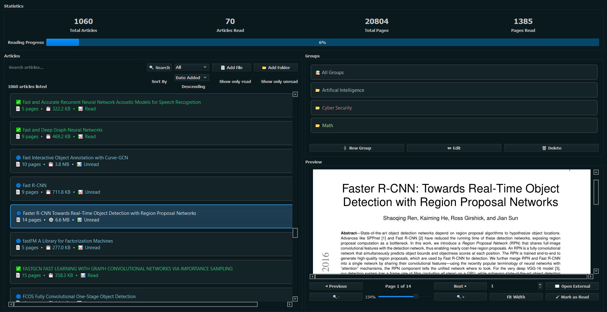

# 📚 Readticle - PDF Article Management System
A comprehensive PDF library management application built with Python



Readticle is a powerful desktop application for managing, organizing, and reading PDF documents. Designed for researchers, students, and professionals who work with large collections of academic papers and documents. Features include intelligent indexing, group organization, reading progress tracking, and statistics.
<br />

## 🔧 Dependencies & Requirements
This application is built with Python 3.9+ and uses the following key packages:
- **PyQt5** - GUI framework
- **PyMuPDF (fitz)** - PDF processing and rendering
- **SQLite3** - Database management (built-in)
- **pathlib** - File system operations

You can install all dependencies using:
```bash
pip install -r requirements.txt
```
<br />

## 🚀 Running the Application
### Option 1: From Source
- Clone this GitHub repository
```bash
git clone https://github.com/iEmreM/Readticle.git
cd Readticle
```
- Install required packages
```bash
pip install -r requirements.txt
```
- Run the application
```bash
python main.py
```

## 📖 Using the Application

### Getting Started
1. **Add PDF Files**: Click "📄 Add File" to import individual PDFs or "📁 Add Folder" to import all PDFs from a directory
2. **Organize with Groups**: Create groups to categorize your articles by topic, project, or any classification system
3. **Track Reading Progress**: Mark articles as read/unread and monitor your reading statistics

### Key Features
- **🔍 Smart Search**: Search through article titles and indexed content
- **👀 PDF Preview**: Built-in PDF viewer with zoom, navigation, and page controls
- **🗂️ Group Organization**: Create custom groups with colors and descriptions
- **⚡ Multi-threaded Indexing**: Background PDF content indexing with progress tracking
- **🎯 Context Menus**: Right-click articles for quick actions (mark read, move to group, open location)
- **📜 Sorting**: Sort articles by title, pages, read status, or date added
- **🔍 Filtering**: Show only read/unread articles using filter checkboxes
- **✉️ External Opening**: Double-click or use context menu to open PDFs in external applications
- **📁File Management**: Access file locations directly from the application
<br />

## 🚀 Planning Features for Short Time
- **📝 Full-text PDF search** - Search within PDF content using existing indexing
- **🏷️ Tag/Label system** - Color-coded tags for better organization
- **⭐ Favorites system** - Bookmark important articles
- **🕒 Recent files tracking** - Quick access to recently opened PDFs
- **📖 Reading progress tracker** - Remember last read page and reading percentage

## 📄 License
See LICENSE file for details.

## 🤝 Contributing
Contributions are welcome! The application is still in development.
